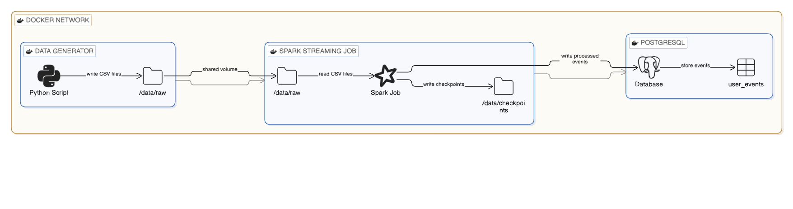

# Real-Time Data Ingestion Using Spark Structured Streaming & PostgreSQL-User Guide
## Tools & Technologies

* **Apache Spark Structured Streaming**
* **PostgreSQL**
* **Python** (for data generation and orchestration)
* **SQL** (for database setup)

---

## Project Structure
Below is the directory structure of the project:
```
project_root/
│
├── data/
│   ├── checkpoints/      # Spark streaming checkpoint files
│   └── raw/              # Raw CSV event data
│
├── deliverables/         # Files to be submitted
│   ├── data_generator.py
│   ├── spark_streaming_to_postgres.py
│   ├── postgres_setup.sql
│   ├── postgres_connection_details.txt
│   ├── project_overview.md
│   ├── user_guide.md
│   ├── test_cases.md
│   ├── performance_metrics.md
│   └── system_architecture.png
│
├──Dockerfile
│
├── etl/
│   ├── extract/          # Scripts for extracting raw data
│   └── transform_load/   # Scripts for transforming and loading data
│
├── logs/                 # Log files for Spark streaming
├── postgres_connection_details.txt
├── main.py               # Orchestrates ETL pipeline
├── requirements.txt
└── .gitignore
```

---

## Project Pipeline Overview

1. **Data Simulation:**

   * Generates fake e-commerce events in CSV format (e.g., `view` or `purchase` with timestamps and product info).

2. **Streaming with Spark:**

   * Spark Structured Streaming monitors the `data/raw/` folder.
   * Processes new CSV files as they arrive.
   * Performs data cleaning and type conversions.

3. **Storing in PostgreSQL:**

   * Sets up a PostgreSQL database and tables.
   * Spark writes the processed data in real time.
   * Ensures that data is inserted without errors and is queryable.

---

## Deliverables

| Deliverable                       | Description                                        |
| --------------------------------- | -------------------------------------------------- |
| `data_generator.py`               | Generates CSV event data                           |
| `spark_streaming_to_postgres.py`  | Spark Structured Streaming job                     |
| `postgres_setup.sql`              | SQL script to create database and tables           |
| `postgres_connection_details.txt` | Host, port, user, and password info                |
| `project_overview.md`             | High-level description of the pipeline             |
| `user_guide.md`                   | Step-by-step instructions to run the project       |
| `test_cases.md`                   | Manual test plan with expected vs actual outcomes  |
| `performance_metrics.md`          | Report with latency, throughput, and other metrics |
| `system_architecture.png`         | Diagram showing data flow and components           |

---

## Testing Checklist

*  Are CSV files being generated correctly?
*  Is Spark detecting and processing new files?
*  Are data transformations correct?
*  Is data being written to PostgreSQL without errors?
*  Are performance metrics (e.g., processing speed) within expected limits?


And a **simplified pipeline flow**:


